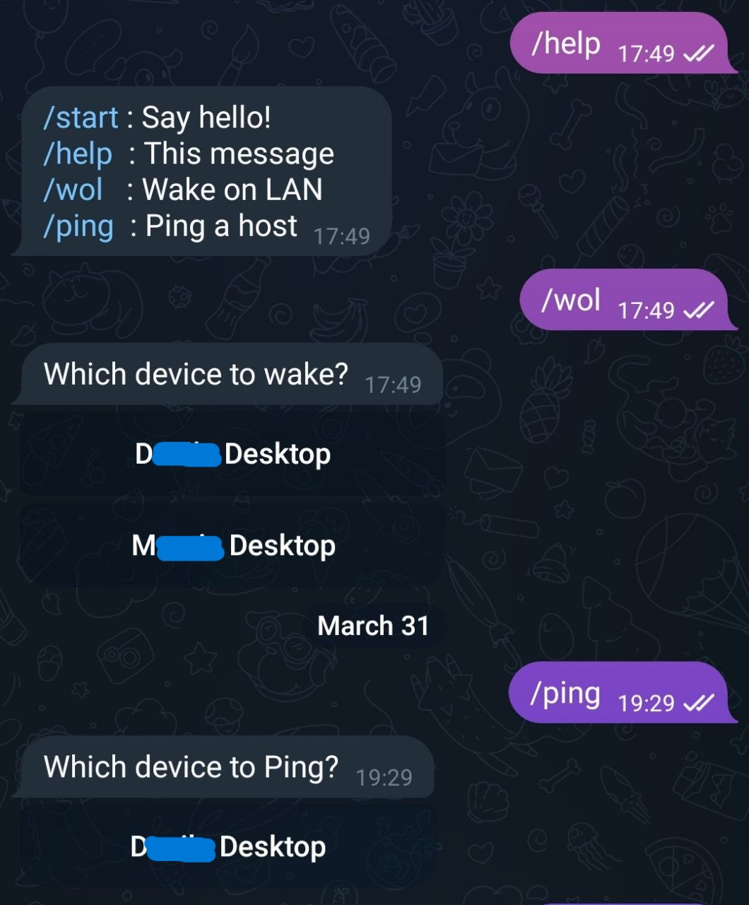

# ESP32 Telegram Wake On Lan

Turn your PC on from anywhere using Telegram and ESP32.

Performs a Wake On Lan (WOL) on a target device. The ESP32 must be connected to
the same Wi-Fi network as the target device and must
have internet connection to Telegram servers.

This program was tested on the NodeMCU ESP32-S module, but should work on any ESP32.
Just make sure you choose the correct libraries on PlatformIO before compiling.

## Setup

### Secrets file

Copy src/secrets.example.h to src/secrets.h and replace the values for:

- Wi-Fi network
- Telegram Bot
- Target device MAC address
- Target device IP address (Optional, for pings)

### Telegram Bot

Create a Telegram bot using [BotFather](https://t.me/botfather) and get the API token.

### Development environment

Install Platform.io for VSCode and install dependencies.

You may need to install drivers for the ESP32. Mine uses a CP210x USB-to-UART bridge.
You can find the drivers here: https://www.silabs.com/developers/usb-to-uart-bridge-vcp-drivers

Just build the project and upload it to the ESP32.
